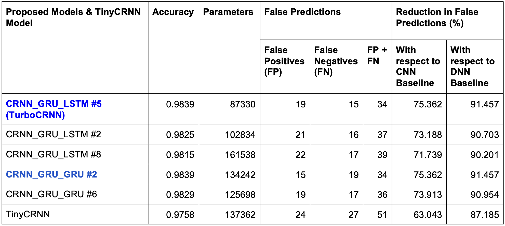

# TurboCRNN: A Robust and Efficient Architecture for Wake Word Detection


## Introduction
This repository contains the implementation of TurboCRNN, a novel and optimized wake word detection model designed to achieve minimal false predictions, reduced latency, and low complexity. The project focuses on preprocessing audio data, extracting features, and using advanced neural network architectures to accurately detect wake words.

## Motivation
Speech is a natural and efficient way of interacting with devices, enhancing multitasking and user experience. Wake word detection is crucial for activating voice assistants and smart systems. Despite significant research, there is a need for lightweight models with reduced false positives that can run efficiently on low-power systems.

## Problem to solve
To build an optimized wake word detection model with minimal false predictions, reduced latency, and low complexity, capable of running efficiently on low-power systems such as mobile devices.

## Dataset
- **Dataset Used**: Google Speech Commands Dataset
- **Details**:
  - 30 Words in total
  - 65,000 Audio Samples in total
  - `.wav` Format
  - Almost 1 second in duration
- **Wake Word**: Marvin
- **Dataset Size**:
  - Marvin: 1746 Samples
  - False Data: 1769 Samples

## Audio Preprocessing
### Denoising
- **Technique**: Wavelet Decomposition using `db4` wavelets from the Daubechies family.
- **Process**:
  - Signal is broken down into frequency bands and noise is removed using thresholding.
  - Denoised audio is reconstructed using inverse wavelet transform.

### Data Augmentation
- **Techniques Implemented**:
  - Time Scaling
  - Pitch Scaling
  - White Noise Addition
  - Polarity Inversion
  - Random Gain
- **Dataset Size After Augmentation**:
  - True Samples: 10476
  - False Samples: 10614
  - Total: 21090

## Feature Extraction
### Techniques


- **Mel Frequency Cepstral Coefficients (MFCCs)**: Commonly used feature extraction technique in speech recognition.
- **Linear Frequency Cepstral Coefficients (LFCCs)**: Compared against MFCCs in our research for better performance.


### Performance Comparison
| Model            | MFCC Accuracy | LFCC Accuracy |
|------------------|---------------|---------------|
| DNN              | 0.7141        | 0.8113        |
| CNN              | 0.9374        | 0.9317        |
| LSTM             | 0.9075        | 0.9692        |
| GRU              | 0.9431        | 0.9787        |
| CRNN_GRU_LSTM    | 0.9493        | 0.9815        |
| CRNN_GRU_GRU     | 0.9663        | 0.982         |

## Neural Networks
### Baseline Model Architectures
- DNN
- CNN
- LSTM
- GRU

### Proposed Model Architectures


- **CRNN_GRU_GRU**: Convolutional Layers + GRU Layer + GRU Layer
- **CRNN_GRU_LSTM**: Convolutional Layers + GRU Layer + LSTM Layer


### Experimentation
- Multi-head Attention
- L2 Regularizer
- Extra Dense Layer

### Optimizer & Loss Functions
- **Optimizer**: AMS Grad Optimizer
- **Loss Function**: Categorical Cross Entropy
- **Train-Test Split**: 80% Training, 10% Validation, 10% Testing
- **Training**: 120 Epochs, Learning Rate = 0.01

## Model Performance Comparison
| Model            | Accuracy | False Positives | False Negatives |
|------------------|----------|-----------------|-----------------|
| DNN              | 0.8113   | 338             | 60              |
| CNN              | 0.9317   | 73              | 71              |
| LSTM             | 0.9692   | 47              | 18              |
| GRU              | 0.9787   | 25              | 20              |
| CRNN_GRU_LSTM    | 0.9815   | 18              | 21              |
| CRNN_GRU_GRU     | 0.982    | 18              | 20              |

## Setup Instructions
### 1. Clone the Repository
```bash
git clone https://github.com/dhairya1702/TurboCRNN
cd TurboCRNN
```

### 2. Set Up Python Environment
```bash
# Using virtualenv
pip install virtualenv
virtualenv venv
source venv/bin/activate  # On Windows, use venv\Scripts\activate

# Using conda
conda create --name myenv python=3.8
conda activate myenv
```

### 3. Install Required Libraries
```bash
pip install numpy scipy librosa matplotlib jupyter
```
### 4.  Running Jupyter Notebooks
```bash
# Install Jupyter Notebook
pip install jupyter

# Start Jupyter Notebook
jupyter notebook
```

### 5. Running Scripts and Notebooks
Notebooks:
```python
MFCC_Extraction_Augmented.ipynb
LFCC_Extraction_Augmented.ipynb
Feature Extraction Techniques - Testbed.ipynb
Data Denoising.ipynb
Data Denoising - TestBed.ipynb
Data Augmentation.ipynb
```

Open these notebooks in Jupyter and run each cell sequentially.
```python
python Dataset Creation Script.py
```

### 6. GRU LSTM Models
```python
GRU LSTM 2.ipynb
GRU LSTM 5.ipynb
GRU LSTM 8.ipynb
```

Open these notebooks in Jupyter and run each cell sequentially.

## Performance Summary



Best Performer in 100k Parameter Budget: CRNN_GRU_LSTM Model Variant #5

With Extra Dense Layer, Without Attention, Without Regularizer - TurboCRNN
75% and 91% reduction in false predictions when compared to CNN and DNN baselines.
74ms and 80ms latencies in the presence and absence of GPU.
87k model parameters, low model complexity.
